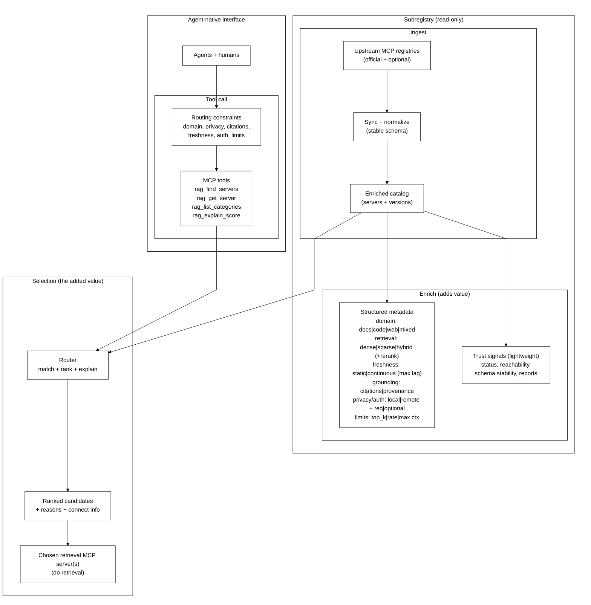

# RAGMap (RAG MCP Registry Finder)

RAGMap is a lightweight MCP Registry-compatible subregistry + MCP server focused on **RAG-related MCP servers**.

It:
- Ingests the official MCP Registry, enriches records for RAG use-cases, and serves a subregistry API.
- Exposes an MCP server (remote Streamable HTTP + local stdio) so agents can search/filter RAG MCP servers.

## MapRag (RAGMap)

**MapRag is a discovery + routing layer for retrieval.**
It helps agents and humans answer: *which retrieval MCP server should I use for this task, given my constraints?*

RAGMap does **not** do retrieval itself. It indexes and enriches retrieval-capable servers, then routes you to the right tool/server.

Full overview: `docs/OVERVIEW.md`

## Architecture


<details>
<summary>Mermaid source</summary>



</details>

## Monorepo layout

- `apps/api`: REST API + MCP registry-compatible endpoints + ingestion worker
- `apps/mcp-remote`: Remote MCP server (Streamable HTTP)
- `packages/mcp-local`: Local MCP server (stdio)
- `packages/shared`: Zod schemas + shared types
- `docs`: docs + Firebase Hosting static assets
- `.ai`: agent artifacts (gitignored runs)

## Local dev

```bash
cp .env.example .env
corepack enable
pnpm -r install
pnpm -r dev
```

API: `http://localhost:3000`
MCP remote: `http://localhost:4000/mcp`

## Ingest

```bash
curl -X POST http://localhost:3000/internal/ingest/run \
  -H "Content-Type: application/json" \
  -H "X-Ingest-Token: $INGEST_TOKEN" \
  -d '{"mode":"full"}'
```

## MCP usage

Remote (Streamable HTTP):

```bash
claude mcp add --transport http ragmap https://<your-mcp-domain>/mcp
```

Local (stdio, npm):

```bash
npx -y @khalidsaidi/ragmap-mcp@latest ragmap-mcp
```

Local (stdio):

```bash
pnpm -C packages/mcp-local dev
```

## Key endpoints

- `GET /health`
- `GET /readyz`
- `GET /v0.1/servers`
- `GET /v0.1/servers/:serverName/versions`
- `GET /v0.1/servers/:serverName/versions/:version` (supports `latest`)
- `GET /rag/search`
- `GET /rag/categories`
- `POST /internal/ingest/run` (protected)

`GET /rag/search` query params:
- `q` (string)
- `categories` (comma-separated)
- `minScore` (0-100)
- `transport` (`stdio` or `streamable-http`)
- `registryType` (string)

## Smoke tests

```bash
API_BASE_URL=https://ragmap-api.web.app ./scripts/smoke-public.sh
MCP_URL=https://ragmap-mcp.web.app/mcp ./scripts/smoke-mcp.sh
```

## Docs

- `docs/DEPLOYMENT.md`
- `docs/OVERVIEW.md`
- `docs/DATA_MODEL.md`
- `docs/PRIVACY.md`
- `docs/PUBLISHING.md`
