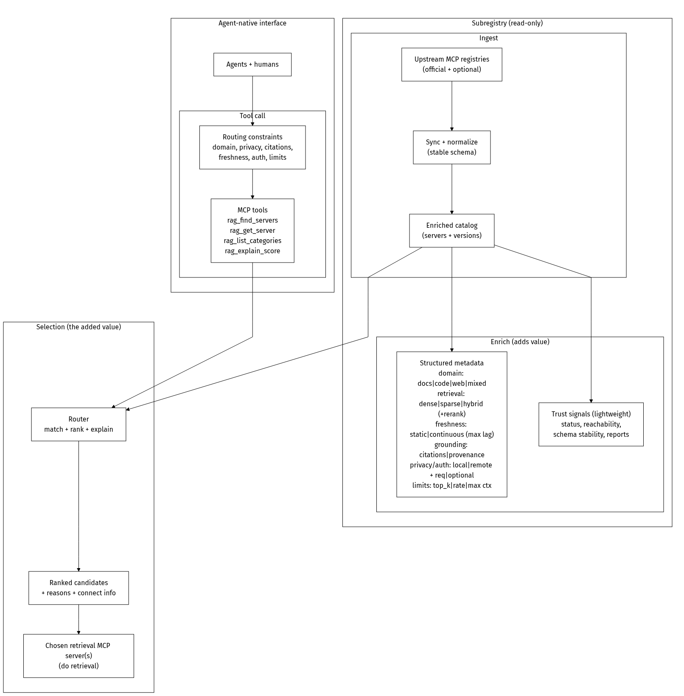
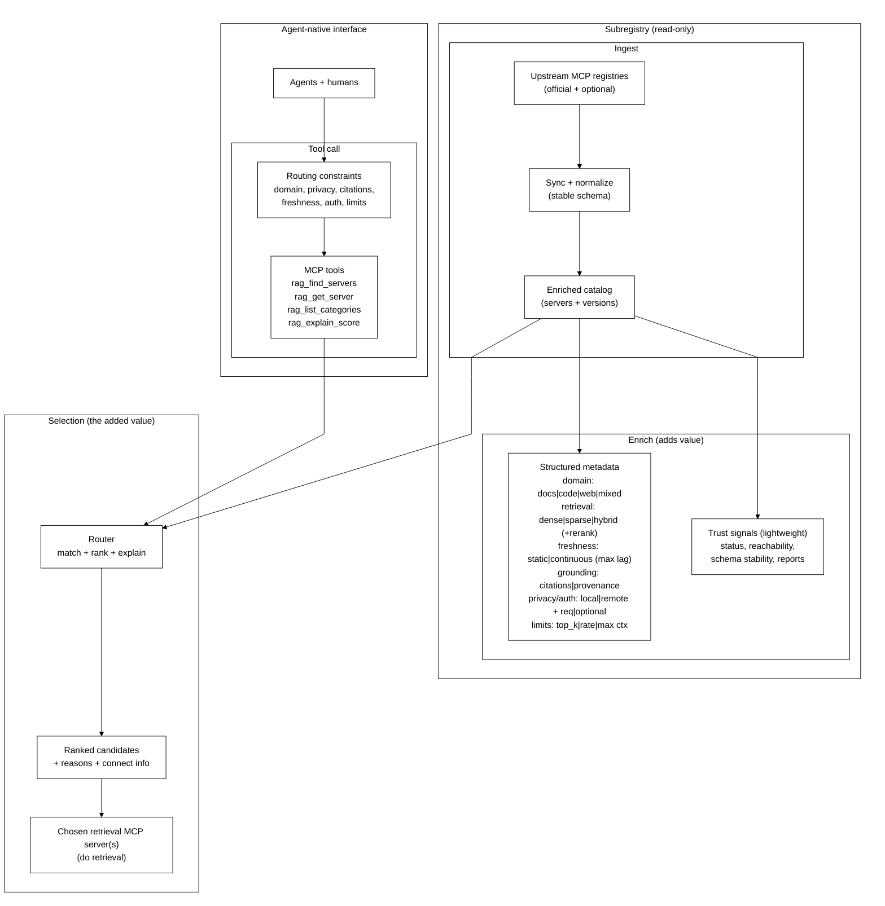

# RAGMap (RAG MCP Registry Finder)

[](https://glama.ai/mcp/servers/@khalidsaidi/ragmap)

RAGMap is a lightweight MCP Registry-compatible subregistry + MCP server focused on **RAG-related MCP servers**.

It:
- Ingests the official MCP Registry, enriches records for RAG use-cases, and serves a subregistry API.
- Exposes an MCP server (remote Streamable HTTP + local stdio) so agents can search/filter RAG MCP servers.

## MapRag (RAGMap)

**MapRag is a discovery + routing layer for retrieval.**
It helps agents and humans answer: *which retrieval MCP server should I use for this task, given my constraints?*

RAGMap does **not** do retrieval itself. It indexes and enriches retrieval-capable servers, then routes you to the right tool/server.

## What you get after install (plain English)

- You get **discovery/routing tools** (`rag_find_servers`, `rag_get_server`, `rag_list_categories`, `rag_explain_score`).
- RAGMap helps you find the best retrieval server for your task and constraints.
- Your agent then connects to that chosen server to do the actual retrieval.

RAGMap does **not**:

- Ingest your private documents automatically.
- Host your personal vector database.
- Replace your end-to-end RAG pipeline.

If you need retrieval over your own data, use a retrieval server from RAGMap results (or your own server) that supports your ingest/index flow.

## Freshness and ingest

- Hosted RAGMap updates its index on a schedule. Newly published/changed servers may appear with some delay.
- Most users do **not** run ingest themselves when using the hosted service.
- If you need tighter freshness control or private indexing behavior, self-host and run your own ingest schedule (`docs/DEPLOYMENT.md`).

**Features:** Registry-compatible API; **semantic + keyword search** (when `OPENAI_API_KEY` is set, e.g. from env or your deployment’s secret manager); categories and `ragScore`; filter by **`hasRemote`**, **`reachable`** (HEAD-checked), **`citations`**, **`localOnly`**, `transport`, `minScore`, `categories`. **Human browse UI** at [ragmap-api.web.app/browse](https://ragmap-api.web.app/browse) — search, filter, copy Cursor/Claude config. MCP tools: `rag_find_servers`, `rag_get_server`, `rag_list_categories`, `rag_explain_score`.

Full overview: `docs/OVERVIEW.md`

## Architecture



<details>
<summary>Mermaid source</summary>



</details>

## Monorepo layout

- `apps/api`: REST API + MCP registry-compatible endpoints + ingestion worker
- `apps/mcp-remote`: Remote MCP server (Streamable HTTP)
- `packages/mcp-local`: Local MCP server (stdio)
- `packages/shared`: Zod schemas + shared types
- `docs`: docs + Firebase Hosting static assets

## Local dev

```bash
cp .env.example .env
corepack enable
pnpm -r install
pnpm -r dev
```

Optional: set `OPENAI_API_KEY` in `.env` (see `.env.example`) to enable **semantic search** locally; `GET /health` will show `"embeddings": true`.

API: `http://localhost:3000`
MCP remote: `http://localhost:4000/mcp`

## Ingest

```bash
curl -X POST http://localhost:3000/internal/ingest/run \
  -H "Content-Type: application/json" \
  -H "X-Ingest-Token: $INGEST_TOKEN" \
  -d '{"mode":"full"}'
```

## MCP usage

Remote (Streamable HTTP):

```bash
claude mcp add --transport http ragmap https://<your-mcp-domain>/mcp
```

Local (stdio, npm):

```bash
npx -y @khalidsaidi/ragmap-mcp@latest
```

Local (stdio):

```bash
pnpm -C packages/mcp-local dev
```

## Key endpoints

- `GET /embed` — embeddable “Search RAG MCP servers” widget (iframe; query params: `q`, `limit`)
- `GET /health` (includes `embeddings: true|false` when semantic search is on/off)
- `GET /readyz`
- `GET /v0.1/servers`
- `GET /v0.1/servers/:serverName/versions`
- `GET /v0.1/servers/:serverName/versions/:version` (supports `latest`)
- `GET /rag/search`
- `GET /rag/categories`
- `GET /api/stats` (public usage aggregates; no PII)
- `GET /api/usage-graph` (HTML chart of usage)
- `POST /internal/ingest/run` (protected)

For hosted `ragmap-api.web.app`, `/internal/*` routes are not exposed publicly.

`GET /rag/search` query params:
- `q` (string)
- `categories` (comma-separated)
- `minScore` (0-100)
- `transport` (`stdio` or `streamable-http`)
- `registryType` (string)
- `hasRemote` (`true` or `false` — only servers with a remote endpoint)
- `reachable` (`true` — only servers whose streamable-http URL passed a HEAD check)
- `citations` (`true` — only servers that mention citations/grounding in metadata)
- `localOnly` (`true` — only stdio, no remote)

## Smoke tests

```bash
API_BASE_URL=https://ragmap-api.web.app ./scripts/smoke-public.sh
MCP_URL=https://ragmap-api.web.app/mcp ./scripts/smoke-mcp.sh
```

## Docs

- `docs/DISCOVERY-LINK-CONVENTION.md` — optional `discoveryService` in server.json so clients can show “Discover more”
- `docs/AGENT-USAGE.md` — **for agents:** discovery, REST API, MCP install (no human intervention)
- `docs/DEPLOYMENT.md`
- `docs/OVERVIEW.md`
- `docs/DATA_MODEL.md`
- `docs/PRIVACY.md`
- `docs/PUBLISHING.md`
- `docs/GLAMA-CHECKLIST.md`
- `docs/GLAMA-DOCKERFILE.md`
- `scripts/glama-score-status.sh` — print public Glama score flags (inspectable/release/usage)
